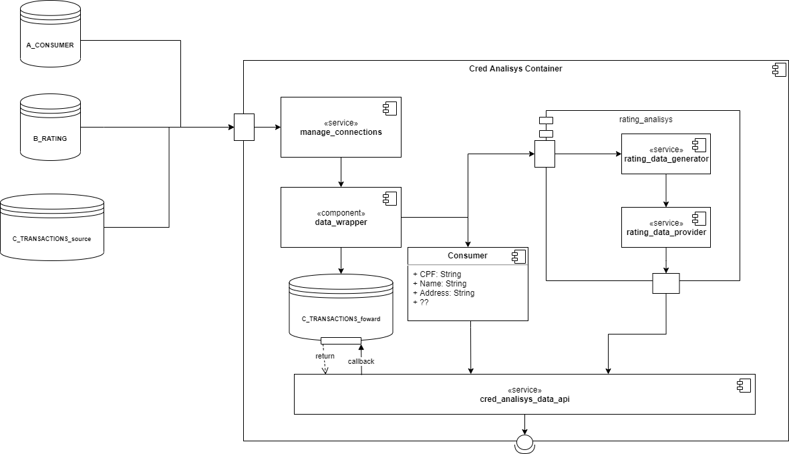

# CREDIT ANALISYS API

### Introdução

A seguir é apresentada uma das possíveis soluções para o problema de analise de credito de forma a gerar algumas discussões quais, precedem a implementação do MVP desta solução, para que sejam identificados possíveis problemas já na sua concepção.

Diagrama de Componentes de uma proposta de API de analise de crédito

### Fontes de dados

Assim como na descrição formal do problema temos três fontes de dados... São representadas no diagrama nesta primeira implementação de forma que possamos ter uma ideia de que fonte de dados estamos tratando atribuindo a nomenclatura referente aos objetivos de cada fonte de dados para facilitar na concepção dos serviços de consulta á essas fontes assim como a definição das ferramentas que irão gerir as mesmas. Sendo assim:

**A_CONSUMER**

Dados dos consumidores quais requerem segurança e acesso que não necessitará de muito desempenho. Essa base de dados pode ter um banco de dados relacional como Postgresql com os mecanismos de segurança devidamente verificados e testados na sua implementação.

**B_RATING**

Dados que necessitam de segurança porém um pouco mais de velocidade no acesso para realizar cálculos de forma performática gerando outros dados durante as consultas. Nesse caso podemos utilizar MongoDB ou ElasticSearch por conta do armazenamento distribuído que bem implementado pode-se acrescentar mais segurança dos dados ao criar redundâncias explorando o melhor da ferramenta escolhida.

**C_TRANSACTIONS**

Uma base de dados extremamente rápida necessita de um pouco mais de atenção quanto as decisões técnicas. Por exemplo ao escolher uma ferramenta como um banco de dados relacional ele irá dizer "Ei não posso ir tão rápido preciso verificar algumas tabelas", ou seja precisaremos de algo mais versátil... Então recorreremos á um banco de dados não relacional que atenderá nossas requisições de forma bem performática com certeza, porém quando nossas requisições escalarem ele poderá nos dizer "Ei posso ser bem rápido, mas que tal pedir um pouco menos?", nesse caso ainda ficamos com uma espécie de gargalo, pois não existe bala de prata nesses casos. Contudo podemos pensar em uma forma de "pedir" menos dados e isso pode-se fazer guardando algumas respostas para entregar em consultas futuras.

### SERVIÇOS E COMPONENTES

Para consultar as fontes de dados foram planejados alguns serviços que devem ser implementados para resolver questões como: Fazer múltiplas conexões nos bancos de dados, tratar os dados recebidos,  implementar módulos de aprendizado de máquina para auxiliar nas analises, entre outros serviços que surgirem como requisito durante o planejamento / desenvolvimento.  Os serviços serão listados a seguir:

**`manage_connections`**

Serviço que será responsável por gerenciar as conexões dos banco de dados, manipulando diferentes fontes de dados e tratando de forma a serem lidos por outros serviços.

**`data_wrapper`**

Componente que manipula os dados de forma a disponibilizar os mesmos em estruturas de dados adequadas para o contexto da aplicação.

**`Consumer`**

Entidade para os dados pessoais do consumidor que serão provenientes de um banco de dados relacional.

- **`rating_analisys`** Modulo de geração de dados provenientes de algoritmos de aprendizado de máquina

    **`rating_data_generator`**

    Serviço qual irá gerar dados utilizando modelos de aprendizado de máquina com base em alguns dados do consumidor

    **`rating_data_provider`**

    Serviço que irá disponibilizar os dados gerados anteriormente para serem consumidos por outros serviços

**`C_TRANSACTIONS_foward`**

Este será um serviço que irá inserir os dados que necessitam de alta velocidade em um banco de dados *memcached* como a ideia inicial é utilizar um banco de dados NoSQL para os dados que necessitam de consultas rápidas e inserir alguns desses dados neste banco que será o Redis. 

**`cred_analilys_data_api`**

Os serviços citados anteriormente serão disponibilizados através de uma API(*Application Programming Interface*) que fornecerá recursos de consulta que necessitarão de ser gerenciados conforme aumentar-mos a complexidade dos serviços.